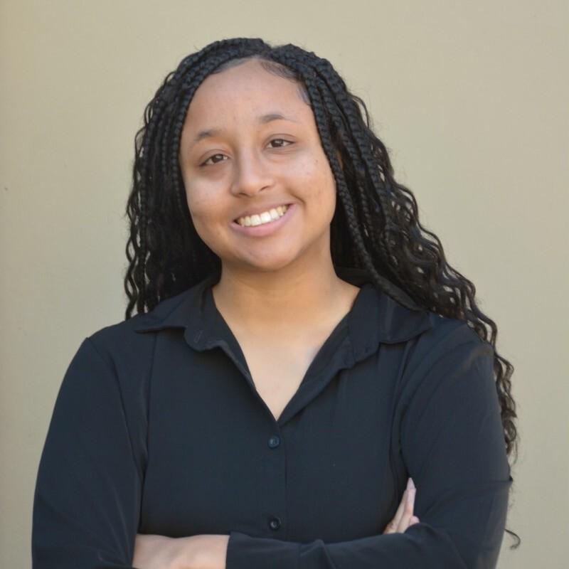
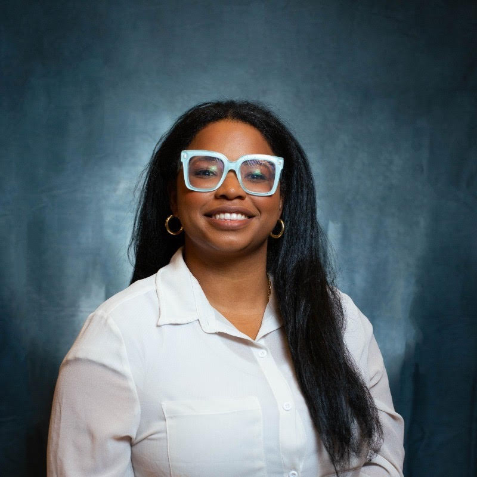

<h1>Meet your Instructors</h1>  

<html lang="en">
<head>
  <meta charset="UTF-8">
  <title>Meet the Instructors</title>
  
</head>
<body>
  

    We are very excited to teach you this fall! If you have logistical questions or concerns,
    please reach out to us via email or Slack!
  

  

    

      
      

        Zewdi Herring
        she/her/hers
      

      

        <a href="mailto:zewdi@hackthehood.org">zewdi@hackthehood.org</a>
      

      

        Hey! My name is Zewdi (Zody) and I use She/Her pronouns. I just graduated from UC Berkeley 
        and I obtained my degree in Data Science. I love teaching and I'm excited to have you all for 
        the Data Science Course at Hack The Hood! Apart from teaching, you can find me at the gym, cooking, 
        or doom scrolling on TikTok. I can't wait to meet you all and hope you have an amazing time in Build :D
      

    

    

      
      

        Sydney Ly
        she/her/hers
      

      

        <a href="mailto:sydney@hackthehood.org">sydney@hackthehood.org</a>
      

      

        Hi! My name is Sydney and I use she/her pronouns. I graduated from UC Berkeley last year with degrees
        in Cognitive Science and Data Science. I taught the Build program for Hack the Hood in Fall 2024, so I'm super
        excited to meet you all this fall! In my free time, I like to cook, read, and spend time with my friends.
        If you see this, tell me your favorite Pokemon! Mine are Umbreon and Lucario :)
      

    

    

      
      

        Aitanna Parker
        she/her/hers
      

      

        <a href="mailto:aitanna@hackthehood.org">aitanna@hackthehood.org</a>
      

      

        Hello All. My name is Aitanna. I was a build Teaching instructor over the summer 
        and a participant last year. I have a lot of opinions about Djing, Critical Race Theory,  
        the WNBA and many more controversial topics. I am excited to join you all this Fall. Woop!
      

    

  

</body>
</html>
